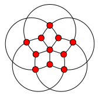
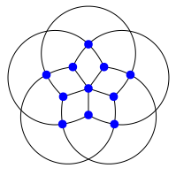
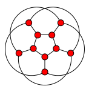
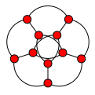

# lombardi-drawings

Code behind a blog post about the Lombardi Spirograph.

## Grötzsch graph

```
python LombardiSpirograph.py grotzsch
```



## Grötzsch graph (with options)

```
python LombardiSpirograph.py \
    --scale=1.2 \
    --color=blue \
    --radius=0.8 \
    --outline \
    grotzsch
```



## Icosahedron graph

```
python LombardiSpirograph.py 3-a01-01-1-a
```


## Petersen graph

```
python LombardiSpirograph.py petersen
```



## Petersen graph (alternative version)

```
python LombardiSpirograph.py 5-b0-a
```



